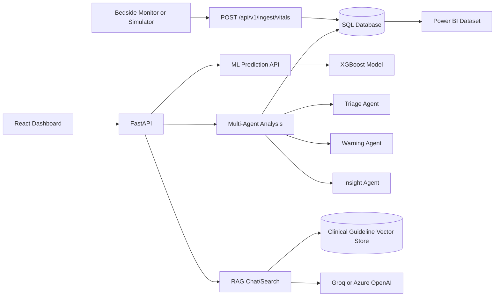
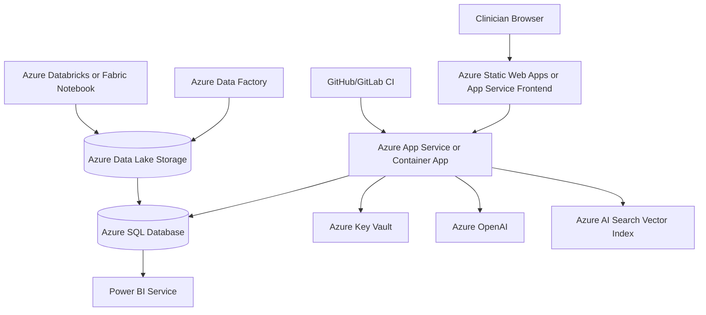

# ClinicalAI Early Warning System Architecture

## Mandatory Component Coverage

| Requirement | Implementation |
| --- | --- |
| Python backend | FastAPI in `src/api/main.py` |
| REST APIs | Data ingestion, ML prediction, RAG search/chat, multi-agent analysis |
| Database | SQLAlchemy with SQLite locally; Azure SQL-ready through `DATABASE_URL` |
| ML/DL | XGBoost classifier trained in `src/ml/training/train_model.py` |
| Model persistence | `src/ml/models/early_warning_model.joblib`, scaler, ONNX export script |
| GenAI/RAG | `ClinicalRAGEngine` with persisted TF-IDF embeddings/vector store and LLM answer generation |
| Agents | Triage, Warning, and Insight agents coordinated by `AgentCoordinator` |
| Azure | Target deployment uses Azure App Service/Container App, Azure SQL, Azure OpenAI or Azure AI Search, and Key Vault |
| Data engineering | `scripts/data_engineering_pipeline.py` creates Raw -> Staged -> Curated lakehouse outputs |
| Analytics | `scripts/export_powerbi_dataset.py` exports Power BI fact/dimension tables |
| Deployment | Dockerfile, docker-compose, and CI pipeline are included |

## Runtime Flow

## Azure Deployment Diagram

## Security Considerations

- Secrets are loaded from environment variables locally and should be backed by Azure Key Vault in production.
- `SECRET_KEY`, database credentials, and LLM keys must not be committed.
- Use managed identity from App Service/Container App to Key Vault, Azure SQL, and Azure AI Search.
- CORS is restricted through `ALLOWED_ORIGINS`.
- Audit events are written for clinical chat, ingestion, and patient analysis.
- Authentication uses JWT-based staff login with role-aware dashboard behavior.
