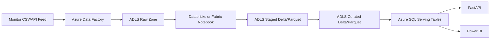

# Data Engineering Pipeline

## Local Pipeline

Run:

```powershell
python scripts/data_engineering_pipeline.py
```

Outputs:

| Layer | Path | Purpose |
| --- | --- | --- |
| Raw | `src/data/lakehouse/raw/vitals` | Original monitor/export records |
| Staged | `src/data/lakehouse/staged/vitals` | Typed, deduplicated, clipped clinical values |
| Curated | `src/data/lakehouse/curated/patient_risk` | NEWS2, engineered features, anomaly flag |

The script writes parquet when a parquet engine is installed and always writes CSV as a fallback.

## Azure Equivalent



## Transformations

- Drop duplicate records.
- Coerce numeric clinical fields.
- Median-impute missing numeric values.
- Clip physiologic values to safe clinical ranges.
- Compute NEWS2 component scores and total score.
- Engineer ML features including pulse pressure, MAP, shock index, SpO2 deficit, respiratory distress, hypotension, tachycardia, fever, and shock indicator.
- Create `is_anomaly` for alert/trend reporting.
